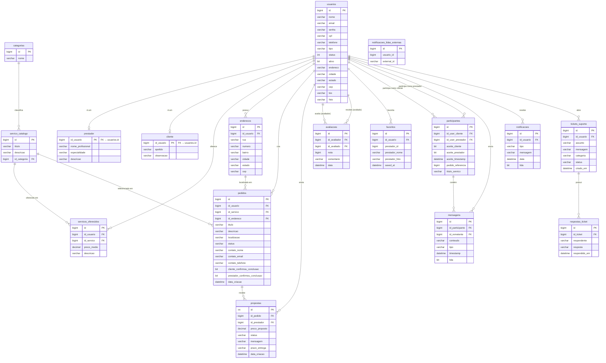

# MER e DER — FazTudoJA

## MER — Modelo Entidade-Relacionamento

### Entidades e Atributos

#### usuarios *(superclasse — herança JOINED)*
| Atributo | Tipo | Restrição |
|---|---|---|
| id | BIGINT | PK, auto-increment |
| nome | VARCHAR(120) | NOT NULL |
| email | VARCHAR(160) | NOT NULL, UNIQUE |
| senha | VARCHAR(128) | NOT NULL |
| cpf | VARCHAR(14) | NOT NULL, UNIQUE |
| telefone | VARCHAR(20) | NOT NULL |
| tipo | VARCHAR(20) | NOT NULL (enum: CLIENTE, PRESTADOR, ADMIN) |
| status | INTEGER | — |
| ativo | BIT | NOT NULL, default 1 |
| endereco | VARCHAR(180) | NOT NULL |
| cidade | VARCHAR(120) | NOT NULL |
| estado | VARCHAR(2) | NOT NULL |
| cep | VARCHAR(8) | NOT NULL |
| bio | VARCHAR(500) | — |
| foto | VARCHAR(MAX) | — |

#### prestador *(extends usuarios)*
| Atributo | Tipo | Restrição |
|---|---|---|
| id_usuario | BIGINT | PK, FK → usuarios.id |
| nome_profissional | VARCHAR(120) | NOT NULL |
| especialidade | VARCHAR(160) | NOT NULL |
| descricao | VARCHAR(500) | — |

#### cliente *(extends usuarios)*
| Atributo | Tipo | Restrição |
|---|---|---|
| id_usuario | BIGINT | PK, FK → usuarios.id |
| apelido | VARCHAR(120) | — |
| observacao | VARCHAR(500) | — |

#### categorias
| Atributo | Tipo | Restrição |
|---|---|---|
| id | BIGINT | PK |
| nome | VARCHAR | NOT NULL |

#### servico_catalogo
| Atributo | Tipo | Restrição |
|---|---|---|
| id | BIGINT | PK |
| titulo | VARCHAR | — |
| descricao | VARCHAR | — |
| id_categoria | BIGINT | FK → categorias.id |

#### servicos_oferecidos
| Atributo | Tipo | Restrição |
|---|---|---|
| id | BIGINT | PK |
| id_usuario | BIGINT | FK → usuarios.id |
| id_servico | BIGINT | FK → servico_catalogo.id |
| preco_medio | DECIMAL(12,2) | — |
| descricao | VARCHAR | — |

#### enderecos
| Atributo | Tipo | Restrição |
|---|---|---|
| id | BIGINT | PK |
| id_usuario | BIGINT | FK → usuarios.id |
| rua | VARCHAR | — |
| numero | VARCHAR | — |
| bairro | VARCHAR | — |
| cidade | VARCHAR | — |
| estado | VARCHAR | — |
| cep | VARCHAR | — |

#### pedidos
| Atributo | Tipo | Restrição |
|---|---|---|
| id | BIGINT | PK |
| id_usuario | BIGINT | FK → usuarios.id (cliente) |
| id_servico | BIGINT | FK → servico_catalogo.id |
| id_endereco | BIGINT | FK → enderecos.id |
| titulo | VARCHAR(160) | NOT NULL |
| descricao | VARCHAR(2000) | NOT NULL |
| localizacao | VARCHAR(160) | NOT NULL |
| status | VARCHAR(30) | NOT NULL (enum: ABERTO, EM_ANDAMENTO, CONCLUIDO, CANCELADO…) |
| contato_nome | VARCHAR(120) | — |
| contato_email | VARCHAR(160) | — |
| contato_telefone | VARCHAR(20) | — |
| cliente_confirmou_conclusao | BIT | default 0 |
| prestador_confirmou_conclusao | BIT | default 0 |
| data_criacao | DATETIME | NOT NULL |

#### propostas
| Atributo | Tipo | Restrição |
|---|---|---|
| id | INT | PK |
| id_pedido | BIGINT | FK → pedidos.id, NOT NULL |
| id_prestador | BIGINT | FK → usuarios.id, NOT NULL |
| preco_proposto | DECIMAL(12,2) | NOT NULL |
| status | VARCHAR(20) | NOT NULL (enum: PENDENTE, ACEITA, RECUSADA…) |
| mensagem | VARCHAR(1000) | — |
| prazo_entrega | VARCHAR(100) | — |
| data_criacao | DATETIME | NOT NULL |
| *(UK)* | — | (id_pedido, id_prestador) |

#### avaliacoes
| Atributo | Tipo | Restrição |
|---|---|---|
| id | BIGINT | PK |
| id_avaliador | BIGINT | FK → usuarios.id |
| id_avaliado | BIGINT | FK → usuarios.id |
| nota | BIGINT | NOT NULL |
| comentario | VARCHAR(1000) | — |
| data | DATETIME | NOT NULL |
| *(UK)* | — | (id_avaliador, id_avaliado) |

#### favoritos
| Atributo | Tipo | Restrição |
|---|---|---|
| id | BIGINT | PK |
| id_usuario | BIGINT | FK → usuarios.id |
| prestador_id | BIGINT | NOT NULL (referência desnormalizada) |
| prestador_nome | VARCHAR(200) | NOT NULL |
| prestador_foto | VARCHAR(MAX) | — |
| saved_at | DATETIME | NOT NULL |
| *(UK)* | — | (id_usuario, prestador_id) |

#### participantes *(canal de chat)*
| Atributo | Tipo | Restrição |
|---|---|---|
| id | BIGINT | PK |
| id_user_cliente | BIGINT | FK → usuarios.id |
| id_user_prestador | BIGINT | FK → usuarios.id |
| aceite_cliente | BIT | — |
| aceite_prestador | BIT | — |
| aceite_timestamp | DATETIME | — |
| pedido_referencia | BIGINT | — (referência ao pedido) |
| titulo_servico | VARCHAR | — |

#### mensagens
| Atributo | Tipo | Restrição |
|---|---|---|
| id | BIGINT | PK |
| id_participante | BIGINT | FK → participantes.id |
| id_remetente | BIGINT | FK → usuarios.id |
| conteudo | VARCHAR | — |
| tipo | VARCHAR | — |
| timestamp | DATETIME | — |
| lida | BIT | — |

#### notificacoes
| Atributo | Tipo | Restrição |
|---|---|---|
| id | BIGINT | PK |
| id_usuario | BIGINT | FK → usuarios.id |
| tipo | VARCHAR | — |
| mensagem | VARCHAR | — |
| data | DATETIME | — |
| lida | BIT | — |

#### notificacoes_lidas_externas
| Atributo | Tipo | Restrição |
|---|---|---|
| id | BIGINT | PK |
| usuario_id | BIGINT | NOT NULL |
| external_id | VARCHAR(255) | NOT NULL |
| *(UK)* | — | (usuario_id, external_id) |

#### tickets_suporte
| Atributo | Tipo | Restrição |
|---|---|---|
| id | BIGINT | PK |
| id_usuario | BIGINT | FK → usuarios.id |
| assunto | VARCHAR(200) | NOT NULL |
| mensagem | VARCHAR(2000) | NOT NULL |
| categoria | VARCHAR(30) | NOT NULL |
| status | VARCHAR(20) | NOT NULL |
| criado_em | DATETIME | NOT NULL |

#### respostas_ticket
| Atributo | Tipo | Restrição |
|---|---|---|
| id | BIGINT | PK |
| id_ticket | BIGINT | FK → tickets_suporte.id |
| respondente | VARCHAR(100) | NOT NULL |
| resposta | VARCHAR(2000) | NOT NULL |
| respondido_em | DATETIME | NOT NULL |

---

### Relacionamentos

| Relação | Cardinalidade |
|---|---|
| usuarios → prestador | 1:1 (herança JOINED) |
| usuarios → cliente | 1:1 (herança JOINED) |
| categorias → servico_catalogo | 1:N |
| usuarios → servicos_oferecidos | 1:N (prestador oferece serviços) |
| servico_catalogo → servicos_oferecidos | 1:N |
| usuarios → enderecos | 1:N |
| usuarios → pedidos | 1:N (cliente cria pedidos) |
| servico_catalogo → pedidos | 1:N |
| enderecos → pedidos | 1:N |
| pedidos → propostas | 1:N |
| usuarios → propostas | 1:N (prestador faz propostas) |
| usuarios → avaliacoes (avaliador) | 1:N |
| usuarios → avaliacoes (avaliado) | 1:N |
| usuarios → favoritos | 1:N |
| usuarios → participantes (cliente) | 1:N |
| usuarios → participantes (prestador) | 1:N |
| participantes → mensagens | 1:N |
| usuarios → mensagens (remetente) | 1:N |
| usuarios → notificacoes | 1:N |
| usuarios → tickets_suporte | 1:N |
| tickets_suporte → respostas_ticket | 1:N |

---

## DER — Diagrama Entidade-Relacionamento

