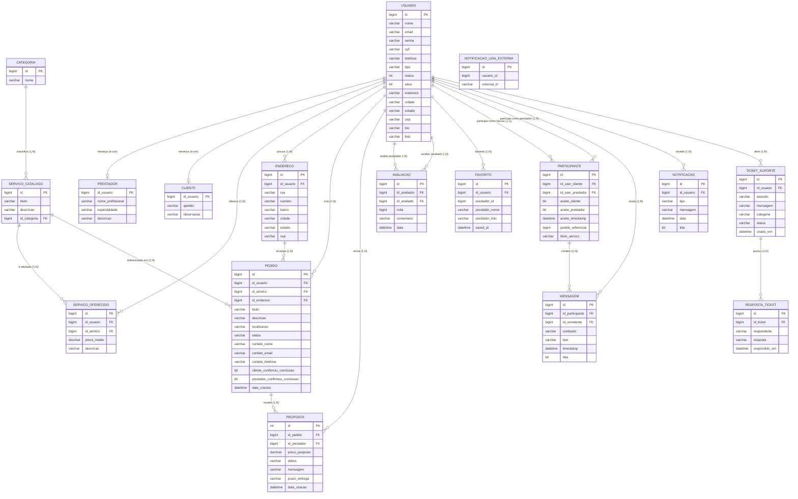

# DER e MER — FazTudoJA

---

## DER — Diagrama Entidade-Relacionamento

> Notação: entidades em **MAIÚSCULO**, atributo sublinhado = chave primária,
> atributo com * = chave estrangeira, cardinalidades no padrão (min, max).

```
╔══════════════════╗         (1,1)          ╔══════════════════╗
║    CATEGORIA     ║ ─────────────────────── ║ SERVICO_CATALOGO ║
╠══════════════════╣  classifica           ╠══════════════════╣
║ <id>             ║                        ║ <id>             ║
║  nome            ║                        ║  titulo          ║
╚══════════════════╝                        ║  descricao       ║
                                            ║ *id_categoria    ║
                                            ╚══════════════════╝
                                                    │ (1,N)
                                                    │ é base para
                                            ╔══════════════════╗
                                            ║SERVICO_OFERECIDO ║
                                            ╠══════════════════╣
                                            ║ <id>             ║
                                            ║ *id_usuario      ║
                                            ║ *id_servico      ║
                                            ║  preco_medio     ║
                                            ║  descricao       ║
                                            ╚══════════════════╝
                                                    │ (N,1)
                                                    │ ofertado por
╔══════════════════╗                        ╔══════════════════╗
║    ENDERECO      ║  (N,1)  pertence a     ║     USUARIO      ║
╠══════════════════╣ ──────────────────────>╠══════════════════╣
║ <id>             ║                        ║ <id>             ║
║ *id_usuario      ║                        ║  nome            ║
║  rua             ║         (N,1)          ║  email           ║
║  numero          ║ abre   ┌──────────────>║  senha           ║
║  bairro          ║        │               ║  cpf             ║
║  cidade          ║        │               ║  telefone        ║
║  estado          ║        │               ║  tipo            ║
║  cep             ║        │               ║  status          ║
╚══════════════════╝        │               ║  ativo           ║
                            │               ║  endereco        ║
╔══════════════════╗        │               ║  cidade          ║
║  TICKET_SUPORTE  ║        │               ║  estado          ║
╠══════════════════╣        │               ║  cep             ║
║ <id>             ║        │               ║  bio             ║
║ *id_usuario ─────╫────────┘               ║  foto            ║
║  assunto         ║                        ╚══════╤═══════════╝
║  mensagem        ║                               │
║  categoria       ║      ┌────────────────────────┼──────────────────────────────┐
║  status          ║      │                        │                              │
║  criado_em       ║      │ herança (1,1)           │ herança (1,1)                │ herança (1,1)
╚══════════════════╝      ▼                        ▼                              ▼
        │ (1,N)   ╔══════════════════╗  ╔══════════════════╗             (admin — sem tabela própria)
        │         ║    PRESTADOR     ║  ║     CLIENTE      ║
╔══════════════╗  ╠══════════════════╣  ╠══════════════════╣
║ RESP_TICKET  ║  ║ <id_usuario> PK/FK║  ║ <id_usuario> PK/FK║
╠══════════════╣  ║  nome_profissional║  ║  apelido         ║
║ <id>         ║  ║  especialidade   ║  ║  observacao      ║
║ *id_ticket   ║  ║  descricao       ║  ╚══════════════════╝
║  respondente ║  ╚══════════════════╝
║  resposta    ║
║  respondido_em║
╚══════════════╝
```

---

### Relacionamentos principais (formato acadêmico)

```
USUARIO ────────────────────── PEDIDO
         (1,N) cria            (N,1)
          um usuário (cliente) cria N pedidos
          um pedido pertence a 1 usuário

PEDIDO ─────────────────────── PROPOSTA
        (1,N) recebe           (N,1)
         um pedido recebe N propostas
         uma proposta pertence a 1 pedido

USUARIO ────────────────────── PROPOSTA
         (1,N) envia           (N,1)
          um prestador envia N propostas
          uma proposta é enviada por 1 prestador

USUARIO ────────────────────── AVALIACAO (como avaliador)
         (1,N) avalia          (N,1)

USUARIO ────────────────────── AVALIACAO (como avaliado)
         (1,N) é avaliado      (N,1)

USUARIO ────────────────────── FAVORITO
         (1,N) favorita        (N,1)

USUARIO ────────────────────── PARTICIPANTE (como cliente)
         (1,N)                 (N,1)

USUARIO ────────────────────── PARTICIPANTE (como prestador)
         (1,N)                 (N,1)

PARTICIPANTE ─────────────── MENSAGEM
              (1,N) contém    (N,1)

USUARIO ────────────────────── MENSAGEM (como remetente)
         (1,N) envia           (N,1)

USUARIO ────────────────────── NOTIFICACAO
         (1,N) recebe          (N,1)

CATEGORIA ─────────────────── SERVICO_CATALOGO
           (1,N) classifica    (N,1)

SERVICO_CATALOGO ─────────── SERVICO_OFERECIDO
                  (1,N)        (N,1)

USUARIO ─────────────────── SERVICO_OFERECIDO
         (1,N) oferece        (N,1)

TICKET_SUPORTE ────────────── RESPOSTA_TICKET
                (1,N) possui   (N,1)
```

---

### DER Completo — Notação Crow's Foot (Mermaid)

> Abrir no VS Code com extensão Mermaid ou em https://mermaid.live



---

## MER — Modelo Entidade-Relacionamento (Esquema Relacional)

> Notação: **PK** = Chave Primária | **FK** = Chave Estrangeira | **UK** = Unique | **NN** = Not Null

---

### USUARIO (_id_, nome, email, senha, cpf, telefone, tipo, status, ativo, endereco, cidade, estado, cep, bio, foto)
- **PK:** id
- **UK:** email, cpf
- tipo ∈ {CLIENTE, PRESTADOR, ADMIN, ADMIN_PRINCIPAL}

---

### PRESTADOR (_id\_usuario_, nome\_profissional, especialidade, descricao)
- **PK:** id\_usuario
- **FK:** id\_usuario → USUARIO(id)  *(herança JOINED)*
- nome\_profissional NN, especialidade NN

---

### CLIENTE (_id\_usuario_, apelido, observacao)
- **PK:** id\_usuario
- **FK:** id\_usuario → USUARIO(id)  *(herança JOINED)*

---

### CATEGORIA (_id_, nome)
- **PK:** id

---

### SERVICO\_CATALOGO (_id_, titulo, descricao, id\_categoria)
- **PK:** id
- **FK:** id\_categoria → CATEGORIA(id)

---

### SERVICO\_OFERECIDO (_id_, id\_usuario, id\_servico, preco\_medio, descricao)
- **PK:** id
- **FK:** id\_usuario → USUARIO(id)
- **FK:** id\_servico → SERVICO\_CATALOGO(id)

---

### ENDERECO (_id_, id\_usuario, rua, numero, bairro, cidade, estado, cep)
- **PK:** id
- **FK:** id\_usuario → USUARIO(id)

---

### PEDIDO (_id_, id\_usuario, id\_servico, id\_endereco, titulo, descricao, localizacao, status, contato\_nome, contato\_email, contato\_telefone, cliente\_confirmou\_conclusao, prestador\_confirmou\_conclusao, data\_criacao)
- **PK:** id
- **FK:** id\_usuario → USUARIO(id) NN
- **FK:** id\_servico → SERVICO\_CATALOGO(id)
- **FK:** id\_endereco → ENDERECO(id)
- status ∈ {ABERTO, EM_ANDAMENTO, CONCLUIDO, CANCELADO, AGUARDANDO_CONFIRMACAO}

---

### PROPOSTA (_id_, id\_pedido, id\_prestador, preco\_proposto, status, mensagem, prazo\_entrega, data\_criacao)
- **PK:** id
- **FK:** id\_pedido → PEDIDO(id) NN
- **FK:** id\_prestador → USUARIO(id) NN
- **UK:** (id\_pedido, id\_prestador)
- status ∈ {PENDENTE, ACEITA, RECUSADA, CANCELADA}

---

### AVALIACAO (_id_, id\_avaliador, id\_avaliado, nota, comentario, data)
- **PK:** id
- **FK:** id\_avaliador → USUARIO(id) NN
- **FK:** id\_avaliado → USUARIO(id) NN
- **UK:** (id\_avaliador, id\_avaliado)
- nota NN (1 a 5)

---

### FAVORITO (_id_, id\_usuario, prestador\_id, prestador\_nome, prestador\_foto, saved\_at)
- **PK:** id
- **FK:** id\_usuario → USUARIO(id) NN
- **UK:** (id\_usuario, prestador\_id)

---

### PARTICIPANTE (_id_, id\_user\_cliente, id\_user\_prestador, aceite\_cliente, aceite\_prestador, aceite\_timestamp, pedido\_referencia, titulo\_servico)
- **PK:** id
- **FK:** id\_user\_cliente → USUARIO(id)
- **FK:** id\_user\_prestador → USUARIO(id)

---

### MENSAGEM (_id_, id\_participante, id\_remetente, conteudo, tipo, timestamp, lida)
- **PK:** id
- **FK:** id\_participante → PARTICIPANTE(id)
- **FK:** id\_remetente → USUARIO(id)

---

### NOTIFICACAO (_id_, id\_usuario, tipo, mensagem, data, lida)
- **PK:** id
- **FK:** id\_usuario → USUARIO(id)

---

### NOTIFICACAO\_LIDA\_EXTERNA (_id_, usuario\_id, external\_id)
- **PK:** id
- **UK:** (usuario\_id, external\_id)

---

### TICKET\_SUPORTE (_id_, id\_usuario, assunto, mensagem, categoria, status, criado\_em)
- **PK:** id
- **FK:** id\_usuario → USUARIO(id) NN
- status ∈ {aberto, em\_andamento, fechado}

---

### RESPOSTA\_TICKET (_id_, id\_ticket, respondente, resposta, respondido\_em)
- **PK:** id
- **FK:** id\_ticket → TICKET\_SUPORTE(id) NN
